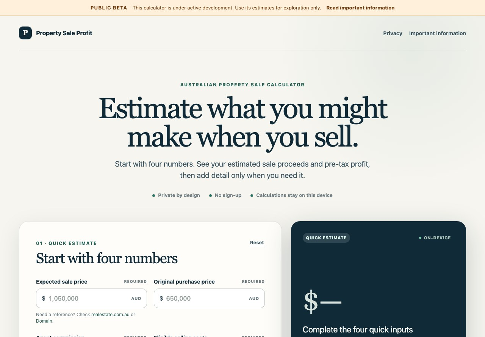

# SaleProfit AU

[](https://github.com/dairuifromcd/australian_property_sale_profit_estimator/actions/workflows/ci.yml)

An Australia-focused, browser-only calculator for estimating property sale
proceeds, pre-tax profit, break-even price, and a deliberately simplified CGT
scenario.



## Why this exists

Sale price minus purchase price is not the same as profit. Agent commission,
CGT-eligible selling costs, sale preparation, buying costs, capital
improvements, property use, and tax treatment can materially change the result.
SaleProfit AU makes those moving parts visible while keeping the first estimate
to four inputs.

## Current features

- Live estimate from expected sale price, purchase price, agent commission, and
  CGT-eligible selling costs
- Optional sale preparation costs, purchase costs, and capital improvements
- Net sale proceeds, pre-tax economic profit, return on cost, and break-even
  sale price
- Optional single-rate tax scenario for the capital gain of an Australian
  resident individual
- Main-residence, investment, and mixed-use scenarios
- Explicit main-residence exemption confirmation and invalid-input feedback
- Print or save the result as a PDF
- Responsive, accessible single-page interface
- No account, database, analytics, or server-side storage of calculator inputs

## Calculation model

At a high level:

```text
net sale proceeds = sale price
                  - agent commission
                  - CGT-eligible selling costs
                  - sale preparation costs

pre-tax profit = net sale proceeds
               - purchase price
               - purchase costs
               - capital improvements

derived CGT cost base = purchase price
                      + purchase costs
                      + capital improvements
                      + agent commission
                      + CGT-eligible selling costs
                      - capital works deductions
```

Sale preparation costs such as styling, cleaning, and non-capital repairs affect
the cash-profit estimate but are not automatically included in the derived CGT
cost base. A reviewed ATO cost base can be supplied for special cases.

The calculator intentionally separates economic profit from settlement cash.
Mortgage balances, loan interest, rates, insurance, maintenance, rental income,
depreciation, and other holding cash flows are not included in this version.

The optional tax result is indicative only. Capital gains form part of income
tax rather than a separate tax, and this calculator applies one assumed rate to
the estimated taxable gain instead of modelling tax brackets, offsets or the
user's full tax return. It does not cover companies, trusts, SMSFs,
foreign-residency rules, capital losses, complex cost-base adjustments, or tax
calculations from 1 July 2027. A $0 main-residence estimate is shown only after
the user confirms that they have checked the full-exemption conditions. The
12-month discount starts on the day after the acquisition-date anniversary,
consistent with the ATO rule that both the acquisition date and CGT event date
are excluded.

## Privacy

Calculator inputs stay in the browser. The application does not currently send
them to a database or external valuation service. Links to third-party property
sites remain ordinary outbound links.

## Technology

- React 19
- TypeScript 5
- Vite 8 with vinext
- Cloudflare Workers-compatible build output
- Node.js 22.13 or newer
- Node's built-in test runner
- Playwright browser tests

## Run locally

```bash
git clone https://github.com/dairuifromcd/australian_property_sale_profit_estimator.git
cd australian_property_sale_profit_estimator
npm ci
npm run dev
```

Open `http://localhost:3000`.

## Quality checks

```bash
npm run lint
npm test
npm run test:e2e
```

`npm test` creates a production build and then runs the calculation and rendered
HTML tests. `npm run test:e2e` starts the application and runs the critical form,
tax, loss-state, reset, and mobile-overflow scenarios in Chromium. Install the
browser once with `npx playwright install chromium`. GitHub Actions runs all of
these checks for pushes and pull requests to `main`.

## Deploy to Cloudflare Workers

The repository is configured for a Worker named `property-profit-au`. Connect
this GitHub repository with Cloudflare Workers Builds and use the following
settings:

| Setting | Value |
| --- | --- |
| Worker name | `property-profit-au` |
| Production branch | `main` |
| Build command | `npm run build` |
| Deploy command | `npx wrangler deploy` |
| Non-production branch deploy command | `npx wrangler versions upload` |
| Root directory | Repository root (leave blank) |

Under **Settings > Build > Branch control**, enable builds for non-production
branches. A push to `main` then updates the production Worker at
`property-profit-au.<your-subdomain>.workers.dev`. A push to any other branch
uploads a new Worker version with a public Preview URL without promoting it to
production.

Preview URLs and the `workers.dev` route are explicitly enabled in
`wrangler.jsonc`. No Cloudflare password, API token, account ID, or GitHub token
belongs in the repository; Workers Builds creates and manages its deployment
token when the repository is connected. For an optional manual deployment,
authenticate locally with `npx wrangler login`, then run `npm run build` and
`npm run deploy`.

## Project structure

```text
app/page.tsx               calculator interface
app/calculator.ts          pure calculation logic
app/globals.css            responsive visual design
tests/calculator.test.ts   calculation scenarios
tests/rendered-html.test.mjs
tests/e2e/                 Playwright browser scenarios
playwright.config.ts       browser test configuration
public/                    social and README images
wrangler.jsonc             Cloudflare Worker and Preview URL configuration
```

## Contributing

Small, focused pull requests are welcome. Use `main` as the stable branch and a
short-lived branch such as `feat/settlement-cash` for each change. See
[CONTRIBUTING.md](CONTRIBUTING.md) for the workflow and quality requirements.

## Disclaimer

SaleProfit AU provides indicative estimates for exploration and education. It
does not provide financial, legal, property valuation, settlement, or tax
advice. Confirm material decisions with appropriately qualified Australian
professionals.

## License

No open-source licence has been selected yet. Until a licence is added, the
copyright owner retains all rights; public access to the repository does not by
itself grant permission to copy, modify, or redistribute the code.
